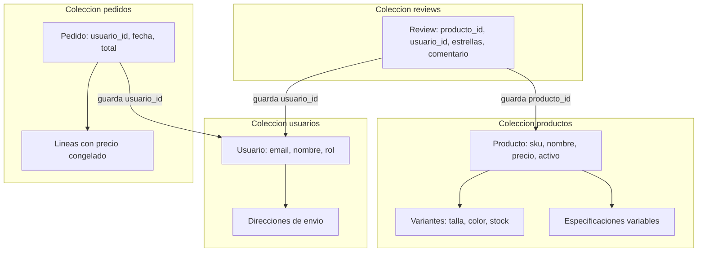

# Paso 1: Conexión al Clúster y Diseño del Modelo

En este primer paso aprenderemos cómo conectarnos a MongoDB Atlas desde la terminal y entenderemos las decisiones de diseño de la base de datos.

---

## 1. Conexión a MongoDB Atlas con `mongosh`

Para conectarnos a la base de datos en la nube no necesitamos instalar ningún servidor local ni utilizar Docker. Usamos directamente la consola oficial de MongoDB (**`mongosh`**).

Abre tu terminal (PowerShell, CMD o Terminal de Linux/Mac) y ejecuta:

```bash
mongosh "mongodb+srv://cluster0.kkqxxz5.mongodb.net/" --apiVersion 1 --username jgarciadeparedesh02_db_user
```

1. La terminal te solicitará la contraseña de tu usuario de base de datos.
2. Una vez dentro de la consola interactiva, cambia a la base de datos de la práctica ejecutando:

```javascript
use ecommerce_db;
```

> **¿Qué hace este comando?** Si la base de datos `ecommerce_db` no existe todavía, MongoDB la creará automáticamente en cuanto insertes el primer dato o crees la primera colección.

---

## 2. El Problema de Negocio: Catálogo de Amazon

Imaginemos que estamos diseñando la arquitectura de datos para el catálogo de **Amazon**.

En Amazon conviven millones de artículos de categorías radicalmente distintas:
- Un altavoz inteligente **Echo Dot** tiene micrófonos, conectividad Wi-Fi y compatibilidad con Alexa.
- Una camiseta de **Amazon Essentials** tiene talla, color y tejido.
- Un ordenador portátil tiene memoria RAM, procesador y disco SSD.

En una base de datos relacional tradicional (SQL), tendríamos un dilema: crear cientos de tablas intermedias o diseñar tablas gigantescas repletas de columnas vacías (`NULL`). En **MongoDB**, gracias a su modelo documental flexible, cada producto almacena únicamente los atributos que necesita.

---

## 3. La Regla de Oro en MongoDB: ¿Embeber o Referenciar?

En MongoDB tenemos dos formas de relacionar la información:
1. **Incrustar (Embeber / Subdocumentos):** Guardar un objeto o array dentro del propio documento.
2. **Referenciar:** Guardar el dato en otra colección y guardar solo su `_id` (similar a una clave foránea).

### ¿Cómo lo aplicamos en Amazon?

- **Variantes de Producto (Tallas, Colores y Stock - Se Incrustan):**
  - Cuando un comprador entra a la página del producto, el menú desplegable de colores y tallas debe cargar al instante con **una sola lectura rápida (*single seek*)**.
  - La cardinalidad es baja y acotada (1 producto suele tener entre 1 y 15 variantes). No hay riesgo de desbordar el documento.
- **Reseñas de Clientes (Se Referencian):**
  - Un artículo popular en Amazon puede acumular 50.000 reseñas con fotos y comentarios largos.
  - Cada documento en MongoDB tiene un límite físico estricto de **16 MB**. Si metiéramos miles de comentarios dentro del producto, superaríamos ese límite y romperíamos el rendimiento de la tienda.
  - Por eso, las opiniones van en su propia colección `reviews`, guardando solo el `producto_id`.
- **Líneas de Pedido (Se Incrustan con Foto Fija - Snapshot):**
  - Si un usuario compra un Echo Dot por 64,99 € y el vendedor sube el precio mañana a 79,99 €, la factura histórica del comprador no debe alterarse. Se guarda una copia inalterable del precio en el momento de la compra.

---

## 4. Tabla de Patrones de Acceso de Amazon

En NoSQL **diseñamos la base de datos a partir de lo que el usuario hace en la pantalla**:

| ¿Qué hace el usuario en Amazon? | Pantalla / Componente Web | Colección | Cómo busca y ordena MongoDB | Paginación o Límite |
| :--- | :--- | :--- | :--- | :--- |
| **P1. Filtra por categoría y precio** | Parrilla de catálogo lateral | `productos` | Filtra por `categoria` y rango de `precio`. Ordena por `precio: 1`. | Paginación con `skip` y `limit` (ej. 20 productos por página). |
| **P2. Escribe en la barra de búsqueda** | Barra superior de Amazon | `productos` | Búsqueda textual mediante índice `$text` sobre el nombre. | Primeros 20 resultados más relevantes. |
| **P3. Entra a ver un producto y elige color** | Ficha de producto (Detalle) | `productos` | Búsqueda por `_id` o `sku` exacto. Devuelve variantes en el mismo documento. | Documento único (sin paginar, respuesta inmediata). |
| **P4. Consulta las opiniones del producto** | Sección inferior de opiniones | `reviews` | Filtra por `producto_id`. Ordena por `fecha: -1` (las más nuevas primero). | Paginación de 10 en 10 reseñas. |
| **P5. Revisa su historial de compras** | Sección "Mis Pedidos" | `pedidos` | Filtra por `usuario_id`. Ordena por `fecha_pedido: -1`. | Paginación estable de pedidos. |
| **P6. Panel de almacén y reposición** | Cuadro de mando logístico | `productos` | Agregación con `$facet`: calcula importe total y filtra variantes con poco stock. | Informe consolidado (un único objeto JSON). |

---

## 4. Mapa Visual de las Colecciones



---

## Resumen del Paso 1
- Nos conectamos directamente al clúster en la nube con `mongosh`.
- Incrustamos lo que se lee junto y tiene tamaño controlado (variantes).
- Referenciamos lo que puede crecer indefinidamente para evitar saturar el límite de 16 MB (reseñas).
