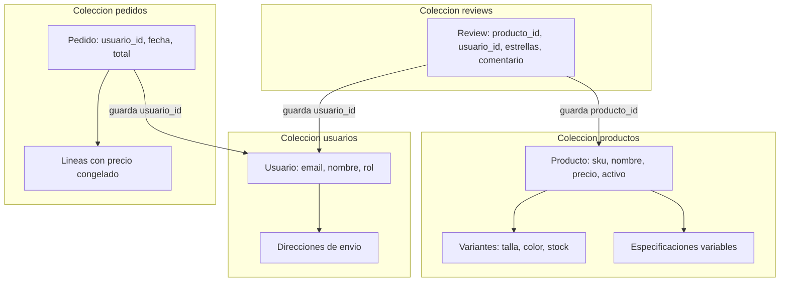

# Paso 1: Conexión al Clúster y Diseño del Modelo

En este primer paso aprenderemos cómo conectarnos a MongoDB Atlas desde la terminal y entenderemos las decisiones de diseño de la base de datos.

---

## 1. Conexión a MongoDB Atlas con `mongosh`

Para conectarnos a la base de datos en la nube no necesitamos instalar ningún servidor local ni utilizar Docker. Usamos directamente la consola oficial de MongoDB (**`mongosh`**).

Abre tu terminal (PowerShell, CMD o Terminal de Linux/Mac) y ejecuta:

```bash
mongosh "mongodb+srv://cluster0.kkqxxz5.mongodb.net/" --apiVersion 1 --username jgarciadeparedesh02_db_user
```

1. La terminal te solicitará la contraseña de tu usuario de base de datos.
2. Una vez dentro de la consola interactiva, cambia a la base de datos de la práctica ejecutando:

```javascript
use ecommerce_db;
```

> **¿Qué hace este comando?** Si la base de datos `ecommerce_db` no existe todavía, MongoDB la creará automáticamente en cuanto insertes el primer dato o crees la primera colección.

---

## 2. El Problema de Negocio: Catálogo de Comercio Electrónico

Queremos gestionar una tienda online con productos de diferentes categorías (ordenadores, ropa, cafeteras, etc.). 

En una base de datos relacional tradicional (SQL), tendríamos problemas porque cada producto tiene especificaciones distintas:
- Un ordenador tiene RAM, procesador y disco.
- Una camiseta tiene talla, color y tejido.

En SQL tendríamos que crear tablas llenas de columnas vacías (`NULL`) o tablas intermedias complejas. En **MongoDB**, al ser una base de datos documental, cada producto puede tener sus propios atributos sin complicaciones.

---

## 3. La Regla de Oro en MongoDB: ¿Embeber o Referenciar?

En MongoDB tenemos dos formas de relacionar datos:
1. **Incrustar (Embeber / Subdocumentos):** Guardar un objeto o array dentro del propio documento.
2. **Referenciar:** Guardar el dato en otra colección y guardar solo su `_id` (similar a una clave foránea).

### ¿Cuándo usamos cada una en nuestra tienda?

- **Variantes de Producto (Tallas, Colores y Stock) 👉 SE INCRUSTAN:**
  - Cuando un usuario entra a ver una camiseta, queremos ver todas las tallas y colores disponibles **de un solo golpe** sin hacer consultas adicionales.
  - Una camiseta tiene pocas variantes (4 o 5 tallas). No hay riesgo de que el documento crezca sin control.
- **Reseñas y Comentarios 👉 SE REFERENCIAN:**
  - Si un producto se hace muy popular, podría llegar a tener 50.000 comentarios.
  - Cada documento en MongoDB tiene un límite de tamaño máximo de **16 MB**. Si metemos miles de comentarios dentro del producto, romperíamos ese límite y la base de datos se volvería lenta.
  - Por eso, las reseñas van en su propia colección `reviews`, guardando solo el `producto_id`.
- **Líneas de Pedido 👉 SE INCRUSTAN CON FOTO FIJA (Snapshot):**
  - Cuando un cliente compra un producto a 100 €, guardamos el nombre y el precio dentro del pedido. Si el vendedor sube el precio mañana a 120 €, la factura del cliente no debe cambiar.

---

## 4. Mapa Visual de las Colecciones



---

## Resumen del Paso 1
- Nos conectamos directamente al clúster en la nube con `mongosh`.
- Incrustamos lo que se lee junto y tiene tamaño controlado (variantes).
- Referenciamos lo que puede crecer indefinidamente para evitar saturar el límite de 16 MB (reseñas).
