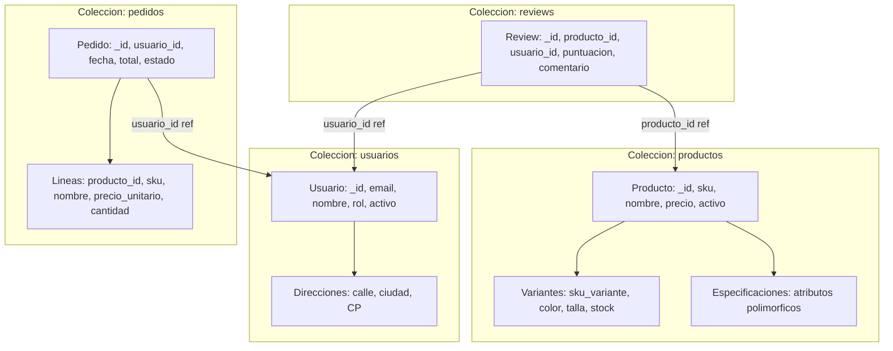

# Modelo de Datos Documental - Catálogo E-Commerce

Este documento justifica las decisiones arquitectónicas tomadas para diseñar la base de datos documental sobre MongoDB.

---

## 1. Diagrama del Modelo Físico

---

## 2. Decisiones de Incrustación (Embedding) vs Referencia (Referencing)

### A) Incrustación (*Embedding*)
- **Variantes en Productos:** Las variantes (talla, color, stock) se consultan siempre conjuntamente al mostrar la ficha técnica de compra del producto. Su cardinalidad es estrictamente acotada (1 producto suele tener entre 1 y 20 variantes). Al incrustarlas, se obtiene el producto completo con un único acceso a disco (*single seek*).
- **Especificaciones Técnicas en Productos:** Atributos polimórficos heterogéneos (una laptop tiene RAM y CPU; una camiseta tiene tejido y transpirabilidad). MongoDB almacena estos objetos sin obligar a columnas nulas de SQL.
- **Líneas de Pedido y Snapshot de Precios:** Se embeben dentro del pedido. Aunque el producto cambie de precio mañana, el pedido almacena el snapshot inmutable del precio acordado en el momento de la transacción.

### B) Referencia (*Referencing*)
- **Reseñas (*Reviews*):** Se modelan en una colección independiente vinculadas mediante `producto_id` y `usuario_id`. Justificación: si un producto popular recibe 100.000 comentarios con texto extenso, incrustarlas dentro del array de productos provocaría:
  1. Riesgo de superar el límite físico de 16 MB por documento en BSON.
  2. Fragmentación de memoria y movimientos de documento en disco al crecer continuamente.
- **Relación Usuario - Pedidos:** Un usuario recurrente puede realizar cientos de pedidos durante años. Se mantiene la referencia en `pedidos.usuario_id`.

---

## 3. Estrategia de Identificadores, Fechas y Estados

- **Identificadores:** Uso estándar de `ObjectId` de 12 bytes autogenerado por MongoDB (timestamp + identificador de proceso + contador secuencial), garantizando ordenación temporal natural sin colisiones.
- **Fechas:** Siempre objetos BSON `Date` en formato UTC (ISO 8601) para permitir indexación por rangos y filtros temporales consistentes.
- **Estados:** Strings validadas mediante listas cerradas `enum` en `$jsonSchema` (`["pendiente", "pagado", "enviado", "cancelado"]`).

---

## 4. Límites del Modelo y Antipatrones Evitados

1. **Evitar Unbounded Arrays (Arrays sin límite):** Ningún array en el modelo crece de forma descontrolada. Las reseñas están fuera del documento de producto.
2. **Límite BSON de 16 MB:** El documento más grande esperado (un producto con 50 variantes) ocupa menos de 8 KB, permaneciendo a órdenes de magnitud de seguridad del límite de 16 MB.
3. **Consistencia Eventual Aceptada:** Si un usuario cambia su nombre de usuario, el histórico de pedidos pasados conserva los datos originales asociados a la compra, favoreciendo el aislamiento fiscal sobre la normalización estricta.
